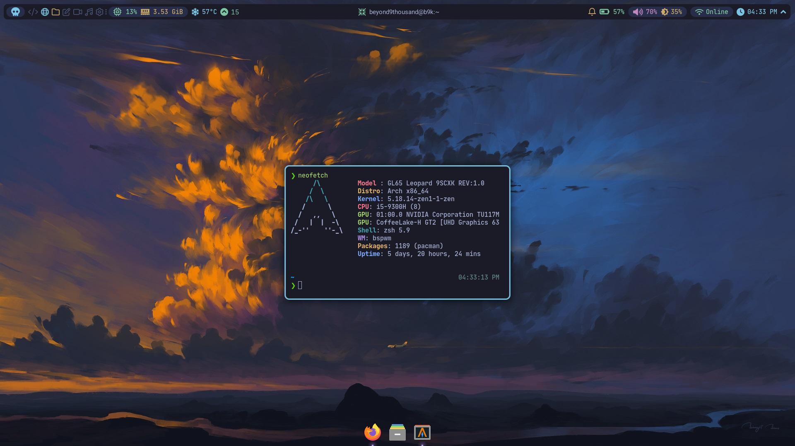
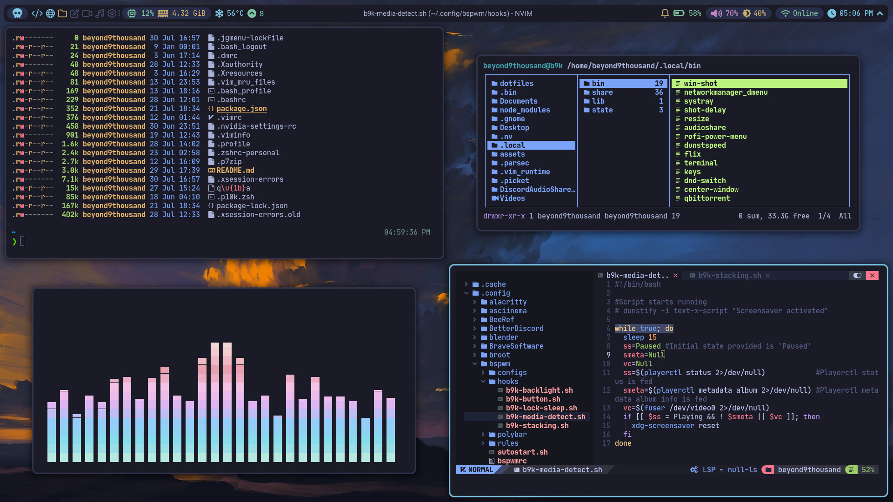
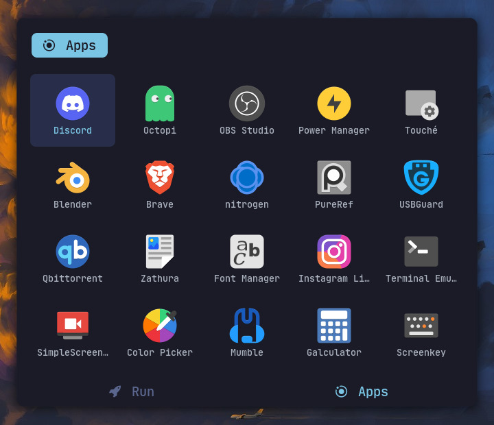
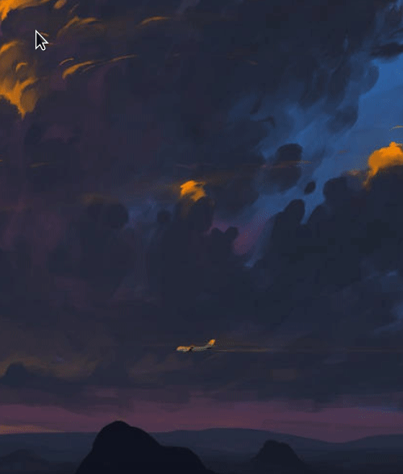
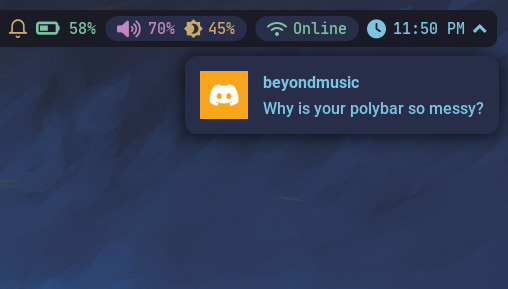
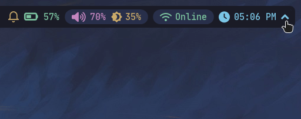

<!-- BADGES -->

<div align="center">

[](https://github.com/beyond9thousand/dotfiles/issues)
[](github.com/beyond9thousand/dotfiles)
[](https://github.com/beyond9thousand/dotfiles/stargazers)
[](https://github.com/beyond9thousand/dotfiles)

</div>

:warning: 'taskbar' setup is in the midst of being migrated to eww. In the mean time, you will find my polybar config located in [`$HOME/.config/not_in_use/`](https://github.com/beyond9thousand/dotfiles/tree/master/.config/not_in_use/polybar) Sorry for the inconvenience caused

# beyond9thousand dotfiles

You are expected to have a basic understanding of the unix system. If you are new to linux, please visit [here](https://linuxjourney.com/lesson/the-shell) or look for similar resources online. Do **NOT** proceed

- [Information](#information)
- [Specifications](#specifications)
- [Showcase](#showcase)
  - [Tokyo Night Colorscheme](#tokyo-night-colorscheme)
  - [Application Launcher](#application-launcher)
  - [Right-click Application Menu](#right-click-application-menu)
  - [Notifications](#notifications)
  - [Drop-down Systray](#drop-down-systray)
- [Fonts](#fonts)
- [Dependencies](#dependencies)
  - [Packages](#packages)
  - [Environment Variables](#environment-variables)
  - [Miscellaneous](#miscellaneous)
- [Credits](#credits)

## :pencil: Information

My configuration is personalized to utilize keyboard shortcuts as well as mouse actions to keep my workflow meaningful and flexible under varying conditions. 

<details close>
  <summary><b>Before proceeding</b></summary>
  
  - This readme is still a work in progress. Please open an issue for queries beyond its scope
  - All the visual config parameters have been written for a [resolution](https://wiki.archlinux.org/title/Xrandr) of 1920x1080 pixels
  - Non GUI apps will need to be configured manually to be correctly displayed in lower/higher resolutions
  - Please read the [man-page](https://wiki.archlinux.org/title/Man_page) for an app before asking specific questions not addressed here

</details>



## :mag: Specifications

| Feature              | Package                                                 |
| -------------------- | ------------------------------------------------------- |
| Window Manager       | [`bspwm`](https://github.com/baskerville/bspwm)         |
| Compositor           | [`pijulius/picom`](https://github.com/pijulius/picom)   |
| Terminal             | [`alacritty`](https://github.com/alacritty/alacritty)   |
| Shell                | [`zsh`](https://www.zsh.org/)                           |
| Editor               | [`neovim`](https://github.com/neovim/neovim)            |
| Panel                | [`polybar`](https://github.com/polybar/polybar)         |
| System Tray          | [`stalonetray`](https://github.com/kolbusa/stalonetray) |
| Dock                 | [`plank`](https://github.com/ricotz/plank)              |
| Notification Manager | [`dunst`](https://github.com/dunst-project/dunst)       |
| Application Launcher | [`rofi`](https://github.com/davatorium/rofi)            |
| Application Menu     | [`jgmenu`](https://github.com/johanmalm/jgmenu)         |

## :camera: Showcase

<div align="center">

##### Tokyo Night Colorscheme

Tokyo night colorscheme ported from [zatchheems](https://github.com/zatchheems/tokyo-night-alacritty-theme) for alacritty



##### Application Launcher

A slightly modified version of the fancy rofi app launcher found on [siduck's repo](https://github.com/siduck/chadwm/tree/main/rofi)



##### Right-click Application Menu

  <div align="left">

The menu is spawned with the help of [xqp](https://github.com/baskerville/xqp) (or X Query Pointer) which prints the ID of the window under the pointer. This is used to check if RMB is being triggered on an empty space, which then calls `jgmenu` to spawn out from the position of the pointer. This method works most accurately since it allows you to spawn the application menu even if your current desktop is occupied (assuming you have gaps between windows)

</div>



##### Notifications

Dunst for a simple notification daemon. eww notification history panel coming soon



##### Drop-down Systray

<div align="left">

Stalonetray is run at bootup and hid right after using [xdo](https://github.com/baskerville/xdo). [`systray`](https://github.com/beyond9thousand/dotfiles/blob/master/.local/bin/systray) local binary is run via a custom ipc module defined in [`modules.ini`](https://github.com/beyond9thousand/dotfiles/tree/master/.config/not_in_use/polybar) which hides or unhides the tray as necessary.

</div>



</div>

## 🔠 Fonts

| Font List                                                                   | Use                 |
| --------------------------------------------------------------------------- | ------------------- |
| [`Roboto`](https://github.com/googlefonts/roboto)                           | Primary Font        |
| [`Font Awesome`](https://github.com/FortAwesome/Font-Awesome)               | Primary Icon Font   |
| [`Icomoon-Feather`](https://feathericons.com/)                              | Secondary Icon Font |
| [`JetBrainsMono Nerd Font`](https://github.com/jtbx/jetbrainsmono-nerdfont) | Primary UI Font     |

## :pushpin: Dependencies

:warning: **The following instructions have only been written for arch-based distros**

#### Packages

Install an AUR helper of your choice

- Using [yay](https://github.com/Jguer/yay#installation) AUR helper

```sh
yay -S \
sxhkd bspwm alacritty zsh neovim polybar stalonetray \
plank dunst rofi jgmenu xprintidle i3lock-color zathura \
broot mpv neofetch ranger xdo perl cava xbanish xss-lock \
pavucontrol nitrogen flameshot exa bat copyq maim \
ant-dracula-kvantum-theme-git ant-dracula-theme-git \
papirus-icon-theme kvantum pacman-contrib
```

#### Environment Variables

Copy the [`.profile`](https://github.com/beyond9thousand/dotfiles/blob/bspwm/.profile) to your `$HOME/` directory to set the correct [environment variables](https://wiki.archlinux.org/title/Environment_variables) at startup

- Refer to [XDG Base Directory](https://wiki.archlinux.org/title/XDG_Base_Directory) for more details

<details close>
 <summary><b>Optional</b></summary>

- Copy the [`zshrc-personal`](https://github.com/beyond9thousand/dotfiles/blob/bspwm/.config/zsh/zshrc-personal) to use my aliases
- Install [zinit](https://github.com/zdharma-continuum/zinit) as a plugin manager for zsh

</details>

#### Miscellaneous

- [powerlevel10k](https://github.com/romkatv/powerlevel10k) as a prompt theme for zsh

## :sparkles: Credits

- Excellent neovim config by [NvChad](https://github.com/NvChad/NvChad)
- [pagankeymaster](https://github.com/pagankeymaster) for helping with various
  bspwm scripts
- Beautiful wallpaper artwork created by [BisBiswas](https://www.deviantart.com/bisbiswas/art/Scattered-Lights-898482741)
- Some configs have been derived from [axyl-os](https://github.com/axyl-os)
